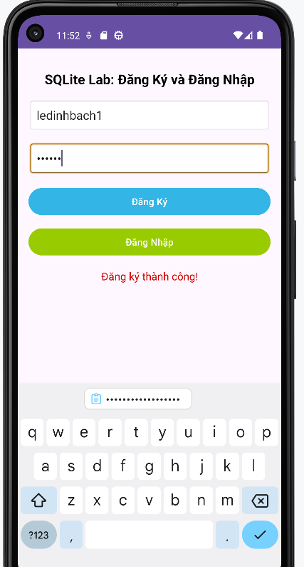

# AndroidAuthentication

This repository contains the source code for the Android Authentication app. The app provides a secure and user-friendly way to authenticate users.

## App Interface

Below are some screenshots of the app interface:

### Login Screen


### Registration Screen


### Dashboard


## Features

- User login and registration
- Secure authentication
- User-friendly interface

## Getting Started

To get started with the project, clone the repository and follow the instructions below.

```bash
git clone https://github.com/yamayaGIN1234/AndroidAuthentication.git
cd AndroidAuthentication
